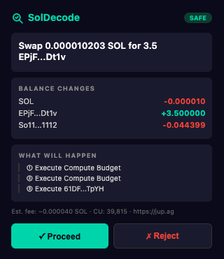
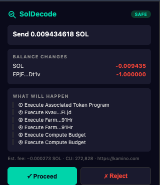
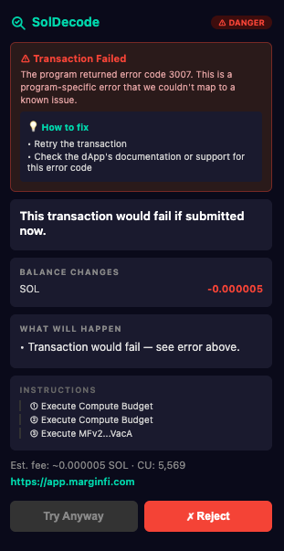

# SolDecode Extension

A Chrome extension that shows you what a Solana transaction will do **before you sign it**.

When a dApp asks you to sign a transaction, SolDecode intercepts the request, simulates the transaction on-chain, and shows a human-readable preview with balance changes, risk warnings, and step-by-step breakdown — all before the Phantom popup appears.

<p align="center">
  
  &nbsp;&nbsp;
  
  &nbsp;&nbsp;
  
</p>

> Above: a Jupiter swap (USDC → cbBTC) with the new "What Will Happen" plain-English summary, a Kamino send showing token symbols + shortened mint addresses, and a MarginFi transaction that would fail — caught and explained before reaching the wallet.
>
> **Live site:** [soldecode-extension on GitHub Pages](https://jvr0x.github.io/soldecode-extension/)

## How It Works

1. **Interception** — SolDecode monkey-patches Phantom's signing methods (`signTransaction`, `signAndSendTransaction`) on the original provider object. It also hooks into the [Wallet Standard](https://github.com/wallet-standard/wallet-standard) protocol used by modern dApps like Jupiter.

2. **Simulation** — When a dApp requests a signature, the extension serializes the unsigned transaction and calls Solana's `simulateTransaction` RPC with `sigVerify: false` and `replaceRecentBlockhash: true`. This executes the transaction against current on-chain state without submitting it.

3. **Decoding** — The simulation result (pre/post balances, token balances, program logs) is decoded into a human-readable preview: what tokens move, which programs execute, and what the net effect on your wallet will be.

4. **Risk Analysis** — The extension parses every top-level instruction structurally (no log scraping) and checks for malicious patterns commonly used by wallet drainers and rug pulls.

   **Instruction-level detectors** (driven by parsed tx data):
   - **Unlimited token approvals** — `Approve` / `ApproveChecked` with `amount == u64::MAX`
   - **Account ownership hijacks** — `SetAuthority` changing the owner of one of your token accounts
   - **Mint / freeze authority changes** — `SetAuthority` on a mint
   - **Foreign-account close** — `CloseAccount` whose rent destination isn't your wallet
   - **Stake authority transfer** — Stake Program `Authorize` / `AuthorizeChecked`
   - **Lookalike destination** — sending to an address whose first/last 4 chars match an address you've previously sent to, but isn't that same address (address-poisoning attack)

   **Balance-level detectors:**
   - **Drain heuristic** — any token wipe ≥ 95% of pre-balance, or SOL wipe ≥ 95% on meaningful balances
   - **Multi-asset outflow** — three or more distinct tokens leaving your wallet at once
   - **High-value outgoing transfers** (> 10 SOL)
   - **Sub-dust incoming SOL** — transactions where you receive < 0.001 SOL as part of a signed operation (drainer bait / poisoning setup)

   **Token-metadata and identity detectors:**
   - **Active mint authority** — receiving a token whose creator can still issue more
   - **Active freeze authority** — receiving a token whose creator can freeze your account
   - **Low liquidity** — receiving a token with < $10k of DEX liquidity (honeypot signal)
   - **Fresh / unknown token** — receiving a token with < 100 holders or no Jupiter listing
   - **USD value asymmetry** — outflow USD value ≥ 2× inflow value (warning), ≥ 10× (critical)
   - **Impersonator tokens** — tokens whose symbol (after NFKD + zero-width strip + Cyrillic/Greek confusable normalization) matches a canonical ticker like USDC / USDT / JUP but whose mint address doesn't

   **Fee-level detectors:**
   - **Oversized priority fees** — priority fees ≥ 0.05 SOL (drain via fee mechanism)
   - **Simulation failures** — the transaction would fail if submitted

5. **Plain-English Preview** — The drawer shows a "What Will Happen" section with natural-language bullets ("Swap 1 USDC for ~0.000014 cbBTC via Jupiter", "Create a cbBTC token account in your wallet (one-time setup)", "Pay ~0.002 SOL in network fees & rent") instead of just raw program names. Tokens are resolved to symbols via the Jupiter token API and displayed alongside their shortened mint address. The technical instruction breakdown is still available in a secondary "Instructions" section.

6. **Preview Drawer** — A slide-in panel appears alongside the Phantom popup showing the decoded preview. You click **Proceed** to continue to Phantom, or **Reject** to cancel the transaction. If the simulation pipeline stalls for more than 30 seconds, SolDecode automatically rejects the transaction rather than sign blind — a hostile page cannot stall the preview as a bypass.

7. **Post-Submission Verification** — After you click Proceed, SolDecode captures the signature from the wallet's return value, polls the chain via `getSignatureStatus`, fetches the finalized tx via `getTransaction`, and compares the actual balance changes against what the simulation predicted. A small non-blocking toast appears at the bottom-right of the page with one of four outcomes: **Confirmed** (actual matches preview within 5%), **Results Differ** (≥ 5% drift on any tracked token — catches MEV sandwich losses, slippage blowouts, and token-address swaps), **Failed** (on-chain error), or **Not Confirmed** (tx not finalized within 60 s). The toast auto-dismisses after 10 s.

## Architecture

```
┌─────────────────────────────────────────────────────┐
│  dApp (Jupiter, Raydium, etc.)                      │
│  calls signTransaction / signAndSendTransaction     │
└──────────────────────┬──────────────────────────────┘
                       │
         ┌─────────────▼──────────────┐
         │  inject.ts (Main World)    │
         │  Monkey-patches provider   │
         │  Serializes unsigned tx    │
         │  Posts to content script   │
         └─────────────┬──────────────┘
                       │ window.postMessage
         ┌─────────────▼──────────────┐
         │  content-script.ts         │
         │  Message bridge            │
         │  Mounts Shadow DOM drawer  │
         └─────────────┬──────────────┘
                       │ chrome.runtime.sendMessage
         ┌─────────────▼──────────────┐
         │  service-worker.ts         │
         │  simulateTransaction RPC   │
         │  Decode balance diffs      │
         │  Risk analysis             │
         └─────────────┬──────────────┘
                       │
         ┌─────────────▼──────────────┐
         │  Preview Drawer            │
         │  Summary + balance changes │
         │  Risk warnings             │
         │  [Proceed] [Reject]        │
         └────────────────────────────┘
```

### Extension Components

| File | Context | Responsibility |
|------|---------|----------------|
| `inject.ts` | Page (Main World) | Patches `window.phantom.solana` methods in-place, intercepts Wallet Standard registrations, serializes transactions, and forwards the connected wallet pubkey so gasless / multi-tx flows decode correctly |
| `content-script.ts` | Isolated World | Bridges messages between inject.ts and service worker, injects Shadow DOM drawer |
| `service-worker.ts` | Background | Calls `simulateTransaction` RPC, parses the tx once via `tx-parser`, computes the real fee, and runs the decoder + risk analyzer |
| `lib/tx-parser.ts` | Background | Parses base64 Solana transactions (legacy + v0) into structured account keys + top-level instructions |
| `lib/fee-calculator.ts` | Background | Computes the actual fee from `Compute Budget` instructions + signature count + simulated CU usage |
| `lib/risk-analyzer.ts` | Background | Structural detectors for drainer / rug patterns (see Risk Analysis above) |
| `ui/drawer.ts` | Shadow DOM | Renders the preview panel with balance changes, plain-English steps, technical instructions, and action buttons |
| `popup/` | Extension Popup | Settings UI: enable/disable toggle, Helius RPC endpoint configuration |

### Why Monkey-Patching?

Phantom's Wallet Standard adapter captures a reference to the original provider object during initialization. A Proxy wrapper creates a **new** object that the adapter never sees. Monkey-patching modifies the methods on the **original** object, so any code holding a reference to it — including the adapter's internal `this._provider` — calls our patched methods.

## Installation

### From Source (Developer Mode)

```bash
# Clone and install
git clone <repo-url>
cd soldecode-extension
npm install

# Build
npm run build

# Load in Chrome
# 1. Open chrome://extensions/
# 2. Enable "Developer mode"
# 3. Click "Load unpacked"
# 4. Select the dist/ folder
```

### Configuration

1. Click the SolDecode icon in the Chrome toolbar
2. Enter your Helius RPC endpoint: `https://mainnet.helius-rpc.com/?api-key=YOUR_KEY`
   - Get a free API key at [dashboard.helius.dev](https://dashboard.helius.dev)
3. Toggle "Extension Enabled" on
4. Click "Save Settings"

## Development

```bash
# Watch mode (rebuilds on file changes)
npm run dev

# Run tests
npm test

# Run tests in watch mode
npm run test:watch

# Production build
npm run build
```

### Testing

The extension uses Vitest for unit tests covering:

- **Tx parser** — Verifies legacy + v0 message parsing, account-index resolution, instruction-data preservation
- **Fee calculator** — Verifies base + priority fee math against hand-crafted Compute Budget fixtures
- **Token cache** — Verifies Jupiter lookup, fallback handling, in-flight dedupe, persistence to `chrome.storage`
- **Simulation decoder** — Verifies balance diff parsing, plain-English step generation, SOL fee dust filtering
- **Instruction parser** — Verifies program log extraction and name resolution
- **Risk analyzer** — Verifies every detector (unlimited approval, account hijack, mint authority, drain, multi-asset, close-to-other, stake authorize, oversized priority fee, high value)
- **Error mapper** — Verifies Solana error code to human-readable explanation mapping

```bash
npm test
```

## Supported Wallets

- **Phantom** (via legacy `window.solana` and Wallet Standard)
- **Jupiter Wallet** (via Wallet Standard)
- **Solflare** (via Wallet Standard)
- **Backpack** (via Wallet Standard)

Brave Wallet is not yet verified.

### Gasless / Multi-Transaction Flows

SolDecode handles dApps that route through a relayer (Jupiter Ultra Gasless) or sign multiple transactions at once. The injection layer reads the connected wallet's pubkey directly from the provider so balance changes are decoded against the **user's** account, not the relayer's. For `signAllTransactions` batches, the **last** transaction in the batch is previewed (this is almost always the meaningful swap; earlier txs are setup like wrap-SOL or ATA creation).

## Supported Transaction Types

The decoder shows balance changes for any transaction. Program-specific decoding is available for:

- Token swaps (Jupiter, Raydium, Orca, Pump.fun, Meteora)
- SOL and SPL token transfers
- Token approvals (flagged as warnings; unlimited approvals flagged as critical)
- SetAuthority operations (account hijacks, mint authority changes)
- Stake Program authority transfers
- CloseAccount with foreign rent destinations

Unsupported transaction types still show raw balance diffs and program names.

## Privacy

- Transactions are simulated via your configured RPC endpoint (Helius) — they are **not** sent to any SolDecode server
- No analytics, tracking, or telemetry
- The extension only activates when a dApp requests a signature
- Your API key is stored locally in `chrome.storage.local`

## License

GPL-3.0 — see [LICENSE](LICENSE)
